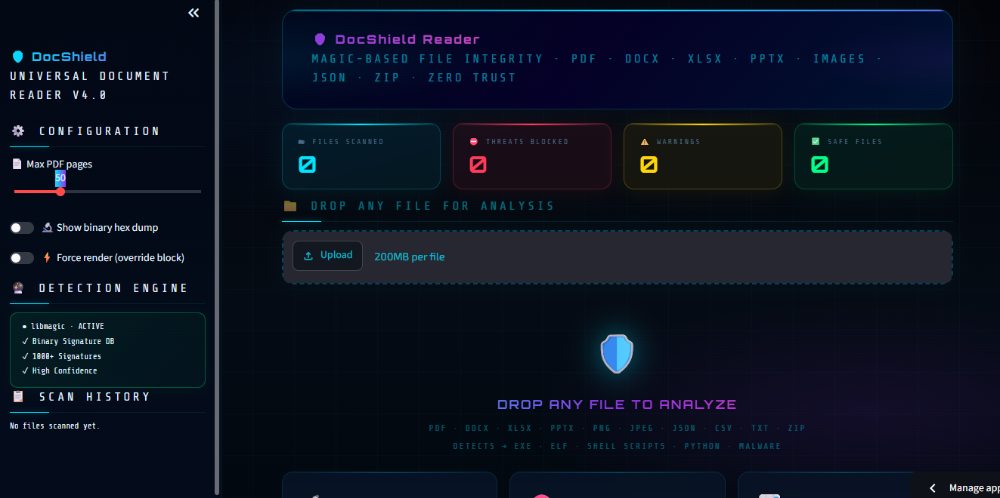

<div align="center">

# 🛡️ DocShield

### Universal Document Reader & File Integrity Verification Tool

A secure Streamlit application that verifies the real type of uploaded files using **magic bytes** before processing them, helping detect extension spoofing and potentially unsafe executables.

[Live Demo](https://jawad-docsshield.streamlit.app/) · [Report an Issue](https://github.com/jawad-hua/universal-docs-reader/issues)

<br>


</div>

---
## Application Preview



## Overview

**DocShield** is a security-focused universal document reader built with Python and Streamlit.

Instead of trusting a file's extension, DocShield inspects its underlying binary signature using **libmagic** to determine the actual file type before processing it.

For example, a malicious executable renamed as:

```text
document.pdf
```

can still be identified by its true binary signature and rejected before normal document processing begins.

The application combines **file integrity verification** with practical document viewing and inspection tools.

---

## Key Features

| Feature | Description |
|---|---|
| Magic Byte Verification | Detects the actual file type from its binary signature |
| Extension Spoofing Detection | Identifies files whose real type does not match their extension |
| Threat Blocking | Rejects executable and potentially unsafe file types |
| Multi-Format Support | Reads PDFs, DOCX, XLSX, images, JSON, CSV, and TXT files |
| PDF Inspection | Supports page-based document viewing, text search, and extraction |
| DOCX Parsing | Reads paragraphs, headings, and tables |
| Excel Viewer | Displays multiple XLSX sheets as structured tables |
| Image Inspection | Displays image metadata such as dimensions and format |
| Hex Dump | Allows inspection of raw binary file headers |
| Session Logging | Maintains a record of files processed during the session |
| Text Export | Extracted PDF text can be downloaded as a `.txt` file |

---

## Supported File Types

| Format | Detection / Processing | Main Features |
|---|---|---|
| PDF | `%PDF` signature | Page viewing, search, text extraction |
| DOCX | ZIP / Office structure | Paragraphs, headings, tables |
| XLSX | ZIP / Excel structure | Multi-sheet table viewing |
| JPEG | JPEG signature | Preview and metadata |
| PNG | PNG signature | Preview and metadata |
| GIF | GIF signature | Preview and metadata |
| BMP | BMP signature | Preview and metadata |
| WEBP | WEBP signature | Preview and metadata |
| JSON | Content validation | Structured text display |
| CSV | Text / delimiter processing | Tabular view |
| TXT | Plain text | Text viewer |
| Executables | Binary signature | Blocked for safety |

---

## Security Approach

DocShield follows a simple principle:

> **Don't trust the extension — verify the file itself.**

Traditional file handling often relies on names such as:

```text
report.pdf
photo.jpg
document.docx
```

However, an extension can easily be changed.

A file named:

```text
invoice.pdf
```

may actually contain executable content.

DocShield checks the file's **magic bytes / binary signature** before deciding how the file should be processed.

### Verification Flow

```text
User Upload
    ↓
Read Binary Signature
    ↓
Detect Real File Type
    ↓
Compare With File Extension
    ↓
 ┌─────────────────┐
 │ Safe Document?  │
 └────────┬────────┘
          │
      Yes │ No
          │
    ↓     ↓
Process   Block
File      File
```

This helps detect:

- Extension spoofing
- Renamed executables
- Files disguised as documents
- Unexpected binary content

---

## Application Workflow

```text
Upload File
    ↓
File Integrity Verification
    ↓
Magic Byte Detection
    ↓
Security Check
    ↓
Document Parser
    ↓
Content Viewer
    ↓
Metadata / Search / Export
```

---

## Tech Stack

| Category | Technology |
|---|---|
| Language | Python |
| Interface | Streamlit |
| File Detection | libmagic / python-magic |
| PDF Processing | pdfplumber |
| Word Documents | python-docx |
| Excel Files | openpyxl |
| Data Processing | pandas |
| Images | Pillow |
| Deployment | Streamlit Community Cloud |

---

## Project Structure

```text
universal-docs-reader/
│
├── universal_reader_app.py
├── requirements.txt
├── packages.txt
└── README.md
```

### Main Files

**`universal_reader_app.py`**  
Contains the Streamlit interface, file verification logic, document parsers, and viewing functionality.

**`requirements.txt`**  
Contains the Python dependencies required by the application.

**`packages.txt`**  
Installs the required system-level `libmagic` dependency for Streamlit Cloud.

---

## Run Locally

### 1. Clone the repository

```bash
git clone https://github.com/jawad-hua/universal-docs-reader.git
cd universal-docs-reader
```

### 2. Create a virtual environment

#### Windows

```bash
python -m venv venv
venv\Scripts\activate
```

#### Linux / macOS

```bash
python3 -m venv venv
source venv/bin/activate
```

### 3. Install dependencies

```bash
pip install -r requirements.txt
```

### 4. Install libmagic

#### Ubuntu / Debian

```bash
sudo apt-get install libmagic1
```

#### macOS

```bash
brew install libmagic
```

For Windows environments where `python-magic` cannot locate the required library:

```bash
pip install python-magic-bin
```

### 5. Start the application

```bash
streamlit run universal_reader_app.py
```

The application should open at:

```text
http://localhost:8501
```

---

## Streamlit Cloud Deployment

The public version of DocShield is deployed using Streamlit Community Cloud.

### Live Application

**https://jawad-docshield.streamlit.app/**

For Streamlit Cloud deployment, `packages.txt` should include:

```text
libmagic1
```

The required Python libraries should be listed in:

```text
requirements.txt
```

---

## Example Security Scenario

Suppose a user uploads:

```text
financial_report.pdf
```

The application does not immediately trust `.pdf`.

Instead, DocShield:

1. Reads the file's binary header.
2. Determines its actual MIME/file type.
3. Checks whether the detected type is safe.
4. Blocks the file if it represents an executable or unsupported binary.
5. Processes it only when verification succeeds.

This provides an additional validation layer before document content is displayed.

---

## Use Cases

DocShield can be useful for:

### Secure Document Inspection

Inspect files before opening or processing their contents.

### File Integrity Verification

Confirm whether a file's real format matches its extension.

### Document Analysis

Read and inspect several common document formats from one interface.

### Security Education

Demonstrate concepts such as:

- Magic bytes
- MIME/file-type detection
- Extension spoofing
- Binary signatures
- Secure file handling

### Developer Utilities

Inspect file headers, metadata, and document structure during development or debugging.

---

## Troubleshooting

### `libmagic` not found on Linux

```bash
sudo apt-get install libmagic1
```

### `python-magic` error on Windows

Try:

```bash
pip install python-magic-bin
```

### Streamlit Cloud deployment fails

Verify that `packages.txt` contains:

```text
libmagic1
```

and that all required Python libraries are present in `requirements.txt`.

### Import errors

Reinstall dependencies:

```bash
pip install -r requirements.txt
```

---

## Security Notes

DocShield provides an additional file-validation layer, but it should not be treated as a replacement for:

- Antivirus software
- Endpoint security
- Malware sandboxes
- Enterprise security gateways

The project is primarily designed for document inspection, secure file-handling demonstrations, and practical security experimentation.

---

## Author

**Muhammad Jawad**

AI/ML Engineer focused on Python, AI applications, automation, and practical software engineering.

[GitHub](https://github.com/jawad-hua) ·
[LinkedIn](https://www.linkedin.com/in/muhammad-jawad-ai/) ·
[Kaggle](https://www.kaggle.com/mjawadjawad)

---

<div align="center">

### 🛡️ DocShield

**Verify the file before trusting the extension.**

</div>
